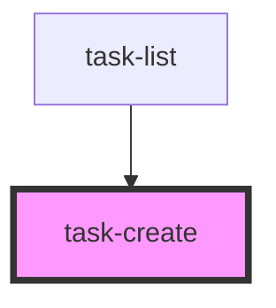

# task-create

<!-- Auto Generated Below -->

## Events

| Event         | Description | Type                |
| ------------- | ----------- | ------------------- |
| `taskCreated` |             | `CustomEvent<void>` |

## Dependencies

### Used by

 - [task-list](../task-list)

### Graph

----------------------------------------------

*Built with [StencilJS](https://stenciljs.com/)*
