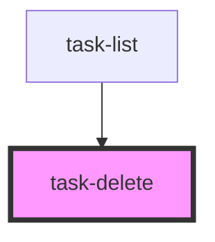

# task-delete

<!-- Auto Generated Below -->

## Properties

| Property | Attribute | Description | Type     | Default     |
| -------- | --------- | ----------- | -------- | ----------- |
| `taskId` | `task-id` |             | `number` | `undefined` |

## Events

| Event         | Description | Type                |
| ------------- | ----------- | ------------------- |
| `taskDeleted` |             | `CustomEvent<void>` |

## Dependencies

### Used by

 - [task-list](../task-list)

### Graph

----------------------------------------------

*Built with [StencilJS](https://stenciljs.com/)*
