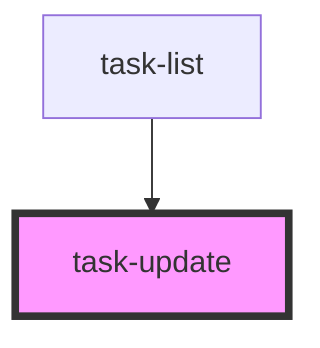

# task-update

<!-- Auto Generated Below -->

## Properties

| Property          | Attribute          | Description | Type     | Default     |
| ----------------- | ------------------ | ----------- | -------- | ----------- |
| `taskDescription` | `task-description` |             | `string` | `undefined` |
| `taskId`          | `task-id`          |             | `number` | `undefined` |
| `taskTitle`       | `task-title`       |             | `string` | `undefined` |

## Events

| Event         | Description | Type                |
| ------------- | ----------- | ------------------- |
| `taskUpdated` |             | `CustomEvent<void>` |

## Dependencies

### Used by

 - [task-list](../task-list)

### Graph

----------------------------------------------

*Built with [StencilJS](https://stenciljs.com/)*
